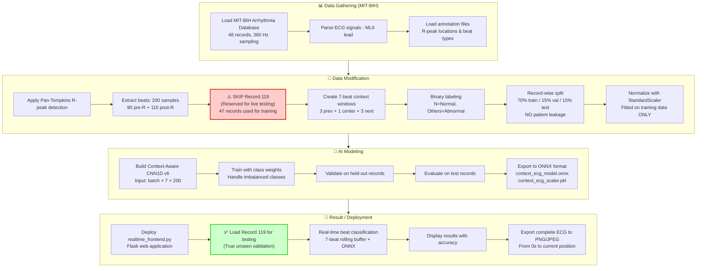

# ECG Classification Pipeline Activity Diagram

This document contains the activity diagram for the ECG Classification Pipeline, showing the complete flow from MIT-BIH data gathering to deployment with vertical swimlanes.

## Overview

The pipeline consists of 4 main partitions:
1. **Data Gathering** - Loading MIT-BIH Arrhythmia Database
2. **Data Modification** - Processing and preparing data (Note: Record 119 is skipped)
3. **AI Modeling** - Training the Context-Aware CNN1D model (v6)
4. **Result / Deployment** - Real-time classification and export

## Activity Diagram (Mermaid)

## Key Points

### Record 119 Exclusion
- **Record 119 is completely skipped during data modification**
- It is reserved exclusively for live testing during deployment
- This ensures true unseen validation - the model has never seen this data

### Data Flow Summary
| Stage | Input | Output |
|-------|-------|--------|
| Data Gathering | MIT-BIH Database (48 records) | Raw ECG signals + annotations |
| Data Modification | Raw signals | Normalized context windows (47 records) |
| AI Modeling | Training/validation data | ONNX model + scaler |
| Deployment | ONNX model + Record 119 | Real-time classification results |

### Export Feature (Updated)
The export to PNG/JPEG now captures the **complete recording from 0 seconds to the current realtime position**, not just the visible graph window.

## PlantUML Version

For a more detailed swimlane diagram, see `ecg_pipeline_activity_diagram.puml` which can be rendered using PlantUML.

## Files Created
- `ecg_pipeline_activity_diagram.puml` - PlantUML source file
- `ECG_PIPELINE_ACTIVITY_DIAGRAM.md` - This documentation with Mermaid diagram
