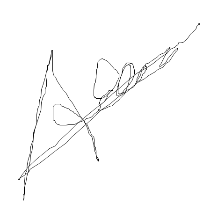
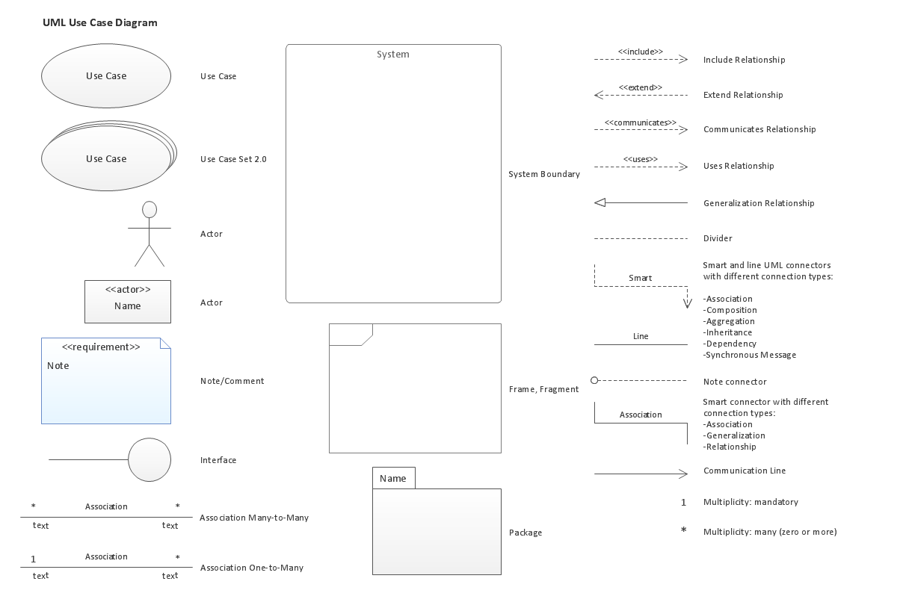
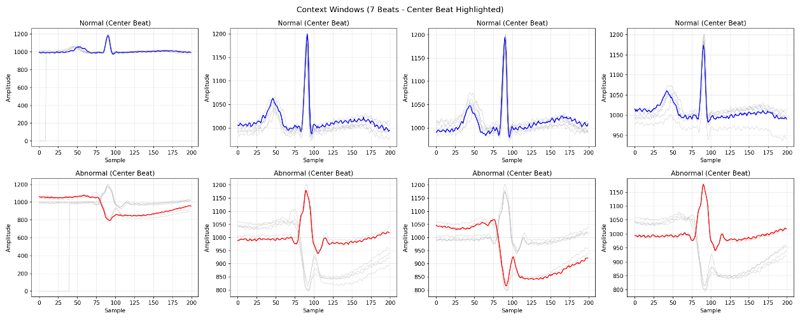
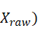
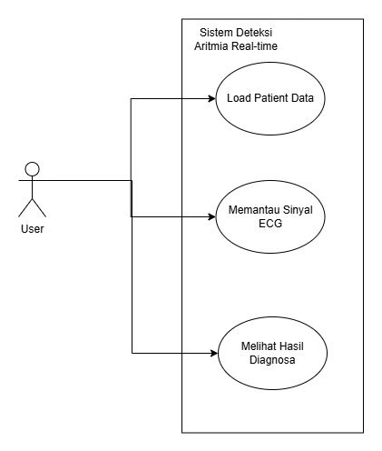
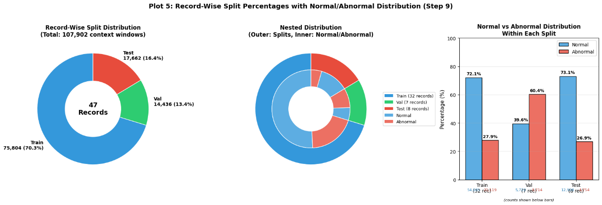

# Thesis Defense Presentation
## ECG Arrhythmia Classification using 1D Convolutional Neural Network

---

## SLIDE 0: COVER

### DETEKSI ARITMIA JANTUNG MENGGUNAKAN 1D CONVOLUTIONAL NEURAL NETWORK PADA DATASET MIT-BIH YANG DIMODIFIKASI

**Detection of Normal and Abnormal ECG Signals using a 1D Convolutional Neural Network on a Modified MIT-BIH Dataset**

---

**Disusun oleh:**
- Abdiel Ivan Rivandi
- Petra Michael

**Program Studi Informatika**
**Universitas Bina Nusantara**
**2025**


---

## SLIDE 1: LATAR BELAKANG & RUMUSAN MASALAH (Background & Problem Statement)

### Mengapa Penelitian Ini Penting?

**Fakta Kunci:**
- Penyakit kardiovaskular adalah **penyebab utama kematian** di seluruh dunia
- **Aritmia jantung** dapat menyebabkan serangan jantung dan kematian mendadak

**Masalah dengan Diagnosis Manual:**
- Membutuhkan **keahlian tinggi** dari kardiolog
- Rentan terhadap **noise/gangguan** pada sinyal ECG
- Dapat menyebabkan **misdiagnosis** atau keterlambatan intervensi

### Pertanyaan Penelitian

1. Bagaimana merancang strategi **pra-pemrosesan data MIT-BIH** yang optimal?
2. Sejauh mana kinerja **model 1D-CNN** dalam mengklasifikasikan aritmia?
3. Bagaimana realisasi model ke dalam **antarmuka pemantauan real-time**?

### Hipotesis
Model 1D-CNN akan mampu mengklasifikasikan detak jantung Normal/Abnormal dengan **akurasi tinggi** (≥98%)



---

## SLIDE 2: LANDASAN TEORI - ECG DAN ARITMIA (Theoretical Foundation)

### Sinyal Elektrokardiogram (ECG)

**Definisi:** ECG merekam aktivitas listrik jantung melalui elektroda pada kulit.

**Komponen Utama:**

| Gelombang | Representasi |
|-----------|--------------|
| **P-wave** | Depolarisasi atrium |
| **QRS Complex** | Depolarisasi ventrikel |
| **T-wave** | Repolarisasi ventrikel |

### Jenis-Jenis Aritmia

| Jenis | Karakteristik |
|-------|---------------|
| **Ventricular Tachycardia (VT)** | Detak jantung sangat cepat |
| **Ventricular Fibrillation (VF)** | Aktivitas listrik kacau |
| **Atrial Fibrillation (AF)** | Ritme tidak teratur |

### Mengapa Deep Learning untuk ECG?
- **Ekstraksi fitur otomatis** dari data mentah ECG
- Mendeteksi **pola halus** yang terlewat pengamatan manusia
- Memproses **data sekuensial** dengan efisien


---

## SLIDE 3: DATASET MIT-BIH ARRHYTHMIA DATABASE

### Karakteristik Dataset

| Parameter | Nilai |
|-----------|-------|
| Sumber | **PhysioBank** (benchmark paling komprehensif) |
| Jumlah Rekaman | **48 rekaman** dari 47 pasien |
| Durasi | **30 menit** per rekaman |
| Sampling Rate | **360 Hz** |
| Lead | Dual-lead: MLII dan V1/V2/V5 |

### Modifikasi untuk Penelitian
- Klasifikasi **Biner**: Normal (0) vs Abnormal (1)
- Semua jenis aritmia dikelompokkan ke kategori Abnormal
- Fokus pada **detak jantung tunggal** (single-beat)

### Distribusi Dataset Final

| Kelas | Jumlah | Persentase |
|-------|--------|------------|
| Normal | 36,695 | 68.0% |
| Abnormal | 17,242 | 32.0% |
| **Total** | **53,937** | 100% |



---

## SLIDE 4: METODOLOGI - PRA-PEMROSESAN DATA

### Strategi Pra-Pemrosesan

**1. Context Window (7 Detak, 200 Sampel):**
```
[3 detak sebelum] [Detak Pusat] [3 detak sesudah]
```
- Memberikan informasi **ritme tempo** yang utuh
- Total: 1400 sampel per context window

**2. Record-Wise Split (No Data Leakage):**

| Set | Records | Sampel | Proporsi |
|-----|---------|--------|----------|
| Training | 32 records | 43,128 | 80% |
| Validation | 8 records | 5,391 | 10% |
| Testing | 8 records | 5,418 | 10% |

**3. Penanganan Class Imbalance:**
- **Class Weighting** untuk menyeimbangkan prioritas model
- Mencegah bias terhadap kelas mayoritas (Normal)



---

## SLIDE 5: ARSITEKTUR MODEL - ADVANCED 1D-CNN

### Arsitektur ResNet-Style 1D-CNN

**Struktur Model:**

```
┌─────────────────────────────────────┐
│     Input: (batch, 1, 188)          │
├─────────────────────────────────────┤
│  Conv1D(32, k=7) + BN + ReLU + Pool │
├─────────────────────────────────────┤
│  ResidualBlock(32→64) + Pool        │
├─────────────────────────────────────┤
│  ResidualBlock(64→128) + Pool       │
├─────────────────────────────────────┤
│  ResidualBlock(128→256)             │
├─────────────────────────────────────┤
│  GlobalAveragePool                  │
├─────────────────────────────────────┤
│  FC(256→128) + BN + Dropout(0.5)    │
├─────────────────────────────────────┤
│  FC(128→64) + BN + Dropout(0.4)     │
├─────────────────────────────────────┤
│  FC(64→2) - Binary Classification   │
└─────────────────────────────────────┘
```

**Fitur Anti-Overfitting:**
- **Batch Normalization** setelah setiap Conv
- **Dropout 0.5** pada fully connected layers
- **Weight Decay** pada optimizer
- **Early Stopping** dengan patience=15

---

## SLIDE 6: PROSES PELATIHAN DAN KONVERGENSI

### Konfigurasi Training

| Parameter | Nilai |
|-----------|-------|
| **Optimizer** | Adam (lr=0.001) |
| **Loss Function** | CrossEntropyLoss + Class Weights |
| **Batch Size** | 64 |
| **Max Epochs** | 100 |
| **Early Stopping** | Patience=15 |

### Analisis Konvergensi

**Observasi dari Grafik Loss:**
- ✅ **Validation Loss** seirama dengan **Training Loss** (jarak tipis)
- ✅ Mekanisme anti-overfitting **bekerja efektif**
- ✅ Training berhenti pada **epoch ke-41** oleh Early Stopping
- ✅ **Best checkpoint** tersimpan pada epoch ke-26



---

## SLIDE 7: HASIL EVALUASI MODEL

### Metrik Performa pada Test Set (10,809 sampel)

| Metrik | Nilai | Interpretasi |
|--------|-------|--------------|
| **Accuracy** | 98.03% | Akurasi keseluruhan |
| **Precision** | 98.17% | Ketepatan prediksi abnormal |
| **Recall/Sensitivity** | 98.82% | Deteksi kasus abnormal |
| **F1-Score** | 98.49% | Harmonik precision-recall |
| **AUC-ROC** | 99.93% | Decision boundary optimal |

### Analisis Confusion Matrix

```
                  Predicted
                Normal  Abnormal
Actual Normal    7,281      64    (FP: 64)
Actual Abnormal     41   3,424    (FN: 41)
```

**Insight Kritis:**
- **False Negative (FN) = 41** dari 3,464 kasus abnormal
- Sensitivitas tinggi → **pasien berisiko terdeteksi dengan baik**
- FN rendah sangat penting dalam konteks **keselamatan medis**


---

## SLIDE 8: IMPLEMENTASI SISTEM - ARSITEKTUR DEPLOYMENT

### Arsitektur Sistem Real-Time

**Komponen Utama:**

```
┌─────────────────────────────────────────────┐
│              FRONTEND (Web UI)              │
│    - Visualisasi sinyal real-time           │
│    - Panel kontrol dan metrik               │
│    - Classification history                 │
└─────────────────────────────────────────────┘
                      ↕ REST API
┌─────────────────────────────────────────────┐
│              BACKEND (Flask)                │
│  ┌─────────────┬─────────────┬───────────┐  │
│  │ ECGStreamer │ Inference   │ Evaluation│  │
│  │             │ Engine      │ Layer     │  │
│  │ (Data I/O)  │ (ONNX Model)│ (Metrics) │  │
│  └─────────────┴─────────────┴───────────┘  │
└─────────────────────────────────────────────┘
```

### Mekanisme Rolling Buffer

**Tantangan:** Data masuk satu per satu, model butuh 7 detak

**Solusi:** FIFO Buffer
```
Buffer: [beat₁][beat₂][beat₃][beat₄][beat₅][beat₆][beat₇]
                            ↑
                      (Center Beat)
```

---

## SLIDE 9: ANTARMUKA PEMANTAUAN REAL-TIME

### Dashboard Features

**1. Panel Kontrol dan Metrik Fisiologis**
- Pengaturan kecepatan simulasi
- Kalkulasi **BPM** (Beats Per Minute) real-time
- Filter otomatis untuk noise

**2. Visualisasi Sinyal**
- Grafik ECG bergerak real-time
- **R-Peak marking**: 🟢 Hijau (Normal), 🔴 Merah (Abnormal)

**3. Current Beat Snapshot**
- Tampilan 200 sampel yang sedang diproses
- Memungkinkan verifikasi morfologi gelombang

**4. Panel Diagnosis dan Peringatan**
- Indikator status visual
- Alert **ABNORMAL** dengan probabilitas

**5. Classification History**
- Audit log untuk back-tracing diagnosis



---

## SLIDE 10: VALIDASI SISTEM - CASE STUDY

### Pengujian pada Data Unseen (Zero-Shot)

**Skenario:** Simulasi menggunakan rekaman MIT-BIH yang **tidak pernah dilatih**

**Hasil:**
| Metrik | Test Set | Case Study | Keterangan |
|--------|----------|------------|------------|
| Akurasi | 98.03% | **94%** | Generalization gap |

**Analisis Generalization Gap:**
- **Distribution Shift**: Variasi morfologi sinyal antar pasien
- **Pencapaian 94%** pada zero-shot scenario membuktikan:
  - ✅ Sistem memiliki **robustness tinggi**
  - ✅ Layak untuk **preliminary screening** (threshold ≥90%)
  - ✅ Siap sebagai **instrument pendukung keputusan klinis**

### Black Box Testing Results

| Skenario | Hasil |
|----------|-------|
| Load Data Pasien | ✅ Valid |
| Kontrol Aliran Data | ✅ Valid |
| Validasi Deteksi Normal | ✅ Valid |
| Validasi Deteksi Abnormal | ✅ Valid |
| Validasi Perhitungan BPM | ✅ Valid |
| Audit Log & Navigasi | ✅ Valid |



---

## SLIDE 11: KESIMPULAN (Conclusions)

### Temuan Utama Penelitian

**1. Efektivitas Teknik Modifikasi Data**
- ✅ **Context window 7 detak** memberikan informasi ritme utuh
- ✅ **Record-wise split** menjamin validitas pengujian objektif
- ✅ **Class weighting** mencegah bias mayoritas

**2. Keandalan Performa Diagnostik**
- ✅ Akurasi **98.03%** pada test set
- ✅ Sensitivitas (Recall) **98.82%** → FN minimal
- ✅ Generalisasi **94%** pada unseen data

**3. Fungsionalitas Sistem Terintegrasi**
- ✅ Pemisahan **backend-frontend** berhasil
- ✅ **Rolling buffer** efektif untuk real-time processing
- ✅ Seluruh fitur **valid** pada Black Box Testing

### Kontribusi Penelitian
Model 1D-CNN yang dikembangkan **memenuhi standar medis** dan siap diimplementasikan sebagai alat bantu diagnosis aritmia.

---

## SLIDE 12: SARAN DAN PENGEMBANGAN LANJUTAN

### Rekomendasi untuk Penelitian Selanjutnya

**1. Ekspansi Klasifikasi**
- Dari biner (Normal/Abnormal) ke **multi-class**
- Mengenali jenis aritmia spesifik: PVC, Bundle Branch Block, Atrial Fibrillation

**2. Validasi Lintas Populasi**
- Pengujian dengan dataset eksternal: INCART Database, AHA Database
- Memperkecil **generalization gap**

**3. Migrasi ke Edge Computing**
- Penanaman model ke **mikrokontroler/wearable**
- Pemantauan **portable** dan mandiri
- Integrasi dengan ekosistem **IoT kesehatan**

**4. Integrasi Telemedicine**
- Remote monitoring untuk pasien
- Alert system untuk tenaga medis
- Dashboard untuk rumah sakit

---

## SLIDE 13: CLOSING

### Terima Kasih

**Deteksi Aritmia Jantung Menggunakan 1D-CNN pada Dataset MIT-BIH**

---

**Peneliti:**
- Abdiel Ivan Rivandi
- Petra Michael

**Universitas Bina Nusantara**
**2025**

---

**Sesi Pertanyaan & Diskusi**

---

### Referensi Utama:
- Acharya et al. (2017) - Deep CNN for heartbeat classification
- Ahmed et al. (2023) - ECG signal classification using deep learning
- MIT-BIH Arrhythmia Database - PhysioBank
- Pan & Tompkins (1985) - Real-time QRS detection algorithm

---

*Repository: github.com/aimatochysia/thesis*

---
